# 枫桥智诉智能体 · 技术架构与验证计划

## 0. 技术栈

### 0.1 技术栈

|层|选型|职责|
|--|--|--|
|前端|React|SPA 构建产物，由 Node.js 服务挂载对外|
|**网关**|**Nginx**|反向代理、HTTPS、WebSocket 转发（不托管静态文件）|
|应用服务|**Node.js 全栈**|**挂载 React**、API、RAG、Agent、入库、图谱、规则|
|RAG/Agent|LangChain.js + LangGraph.js|检索链、Agent 编排|
|存储|PostgreSQL + Neo4j / SurrealDB|业务 + 向量 + 图谱|
|对象存储|阿里云 OSS / MinIO（可私有化）|文件原件|
|大模型|DeepSeek|推理|
|Embedding / Reranker|API 调用|向量化、重排序|

### 0.2 整体架构

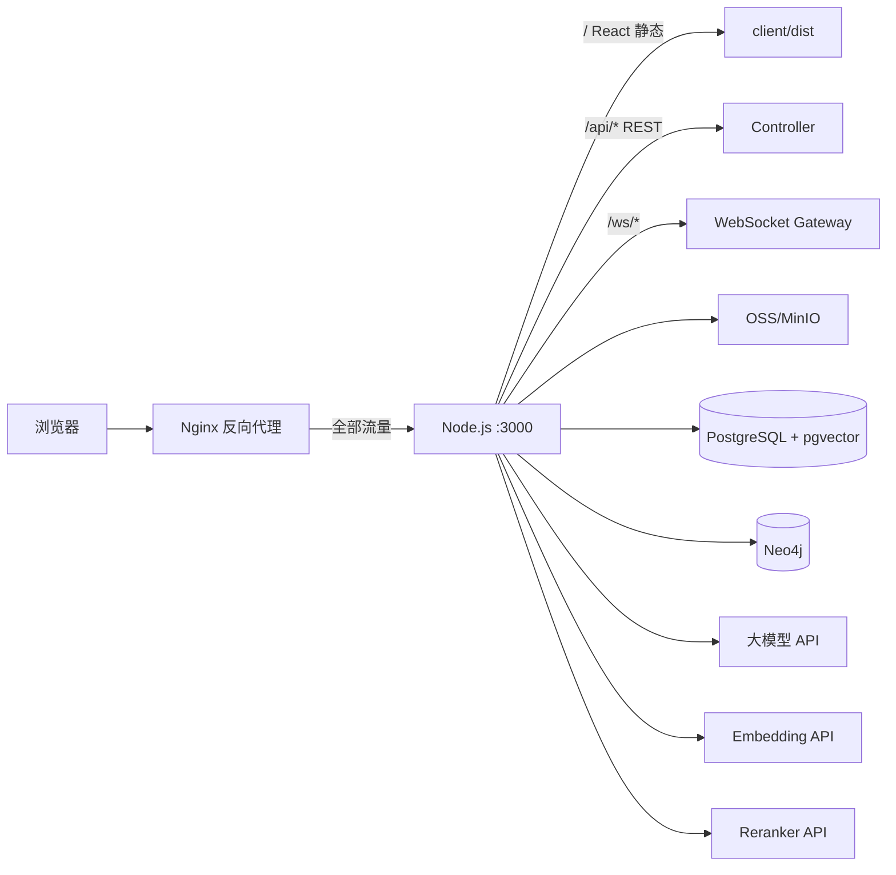

**前端访问地址：**

- 页面：`https://domain.com/`（Nginx 转发 → Node.js 挂载 React）
- API：`https://domain.com/api/...`
- 问答 WS：`wss://domain.com/ws/chat?token=xxx`（Nginx 转发 → Node.js WebSocket）

**RAG 检索链路：** 用户提问 → Embedding 向量化 → PG 召回 Top-20 → **Reranker 重排 Top-5** → LLM 生成

**Node 后端模块划分：**

|模块|技术|职责|
|--|--|--|
|`static`|express.static 等|挂载 React 构建产物，`/` 及 SPA 路由|
|`api`|REST 路由|上传、报告、问答、管理后台 API|
|`auth`|JWT / Session|鉴权、**角色权限**、用户库隔离|
|`storage`|ali-oss / minio SDK|文件存取|
|`ingest`|pdf-parse + mammoth|文档解析、切分、分类、**打标**、入库|
|`rag`|LangChain.js + PGVector + Reranker API|向量召回 + **重排序** + 引用组装|
|`graph`|neo4j-driver|图谱 CRUD、多跳查询|
|`agent`|LangGraph.js + WebSocket|Agent 编排、**WS 多轮会话**、流式输出|
|`rules`|JSON/YAML 规则引擎|用工/合同硬性校验|

**前端只访问 Nginx 域名**（不直连 Node 端口）；页面/API/WS 均由 Nginx 转发到 Node.js 同一进程。智能问答见 0.2.1。

#### 0.2.1 智能问答：WebSocket 长连接多轮

**智能问答是长连接、多轮对话。**

|能力|实现|
|--|--|
|长连接|`wss://domain/ws/chat`，经 **Nginx** 转发到 Node.js|
|多轮追问|同一连接反复发 `message`，服务端维护 `session_id` + history|
|流式输出|服务端推送 `token` → `citation` → `done`|
|绑定报告|连接时或中途发 `bind_report`，后续问答带报告上下文|
|中断生成|客户端发 `{type:'stop'}`|

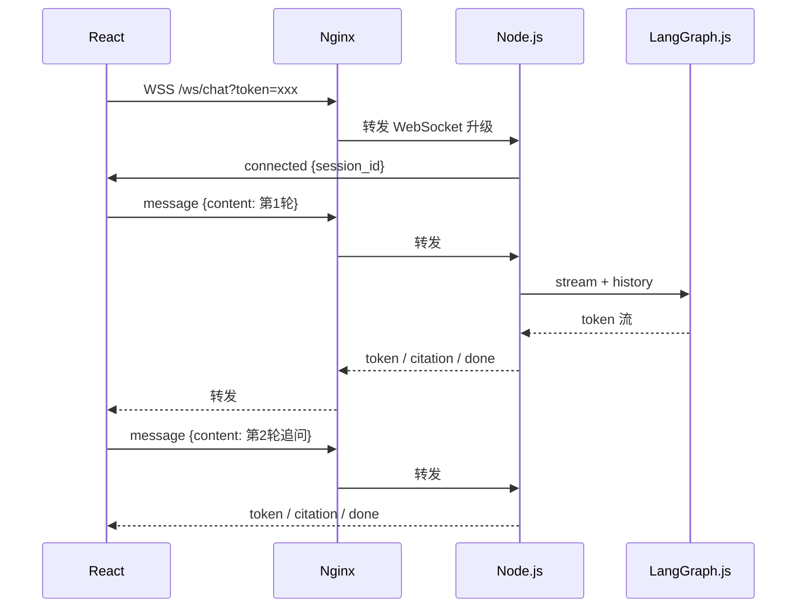

**WebSocket 消息协议：**

```
// 客户端 → 服务端
{type: "init",        report_id?: "report-uuid"}     // 建连后首包，可绑定报告
{type: "message",     content: "报告第2条风险严重吗？"}  // 每轮提问
{type: "bind_report", report_id: "report-uuid"}     // 中途切换/绑定报告
{type: "stop"}                                       // 中断当前生成

// 服务端 → 客户端
{type: "connected",   session_id: "conv-uuid"}

{type: "token",       content: "根据"}

{type: "citation",
  chunk_id: "chunk-uuid",           // 引用的文本块 ID
  document_id: "doc-uuid",          // 来源文档 ID
  source_title: "劳动合同法第39条",
  source_type: "law|case|report|user_doc",
  excerpt: "用人单位可以解除劳动合同…",
  page: 12
}

{type: "done",
  message_id: "msg-uuid",
  confidence: 85,
  citations: [
    { chunk_id, document_id, source_title, source_type }
  ],
  suggested_questions: [
    "第2条风险如果不改会怎样？",
    "有没有类似合同纠纷的判例？",
    "建议怎么修改这一条款？"
  ]
}

{type: "error", message: "..."}
```

**消息类型说明：**

|type|作用|前端处理|
|--|--|--|
|`token`|流式文字|逐字追加到气泡|
|`citation`|单条引用（生成过程中逐条推送）|引用卡片，点击用 `document_id` + `chunk_id` 跳原文|
|`done`|本轮结束|展示置信度、引用汇总、**推荐问题** chips|
|`suggested_questions`|在 `done` 内|点击即发送下一轮 `message`，降低输入成本|

**引用 ID 对应：**

|字段|库表|
|--|--|
|`document_id`|`documents.id`|
|`chunk_id`|`document_chunks.id`|

**Node 实现要点：**

- WebSocket 服务（如 `ws`），连接内只维护 `session_id`、`report_id`（轻量状态）
- **history 直接落库**：收到 `message` 即写 `messages`（role=user）；`done` 后写 assistant 消息 + `message_citations`
- 每轮问答前：从 PG 读该会话**最近 10 轮** `messages` 组装 Agent context（不依赖内存/Redis）
- **Redis 缓存（可选，量大再加）**：热点会话 history 缓存，Key=`conv:{session_id}:history`，TTL 30min；写 PG 后删缓存或更新
- `LangGraph.stream()` 读 token → 推送 `token`
- 检索命中时推送 `citation`（带 `chunk_id` + `document_id`）
- 本轮结束推送 `done`（含 `citations` 汇总 + LLM 生成 `suggested_questions`）
- 断线重连：带 `session_id` 重连，从 PG 拉 history（有 Redis 则先读缓存）

**history 读写流程：**

```
message 到达 → INSERT messages(user)
            → SELECT 最近10轮 FROM messages WHERE conversation_id=?
            → Agent 生成
done 到达   → INSERT messages(assistant) + message_citations
            → （可选）UPDATE Redis 缓存
```

|场景|方案|
|--|--|
|多轮智能问答|**WSS** `/ws/chat`（经 Nginx 转发）|
|加载历史记录|REST `GET /api/conversations/:id`|
|上传 / 生成报告|REST 经 Nginx `/api/upload`、`/api/analyze`|

#### 0.2.2 docker-compose 部署结构

```
docker-compose
├── nginx          ← 对外 :443 / :80，纯反向代理 → app:3000
├── app         ← 内网 :3000，挂载 React + API + WS，不对外暴露
├── postgres       ← pgvector
├── neo4j          ← 图谱（或 surrealdb）
└── redis          ← 可选，history 缓存
```

## 1. 总体架构

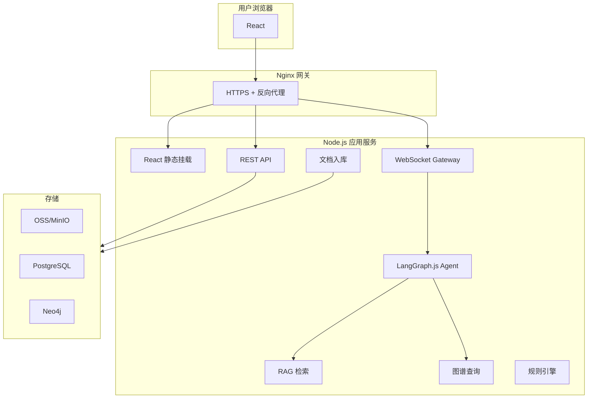

---

## 1.5 产品主流程：两条线

### 用户线（街道 / 中小企业 / 信访）

**核心路径：** 上传材料 → 生成分析报告 → 智能问答（**可基于报告追问，也可不绑定报告直接交互**）

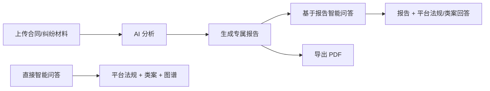

|步骤|用户做什么|系统做什么|对应模块|
|--|--|--|--|
|① 上传|上传合同、纠纷描述、证据材料|入**用户私有库**，按 user_id 隔离|M1/M2/M3 入口|
|② 分析|点击「生成报告」|Agent 读用户材料 + 查平台法规/类案/图谱 → 输出结构化报告|M1/M2/M3|
|③ 问答|**两种入口任选**：<br/>· 直接打开聊天框提问<br/>· 从报告页「基于此报告问答」|· **通用问答**：平台法规 + 类案 + 图谱<br/>· **报告问答**：用户报告 + 用户材料 + 平台库联合检索|智能问答|
|④ 导出|下载报告（可选）|报告 PDF + 引用溯源|—|

**举例（中小企业 · 报告问答）：**

1. 上传劳动合同 → 系统生成《合同审查报告》（3 处风险 + 法条引用）
2. 点击「基于此报告问答」追问：「第 2 条风险如果不改会怎样？」→ AI 结合**报告第 2 条** + **平台类案**回答

**举例（中小企业 · 直接问答）：**

1. 不上传材料，直接问：「试用期最长多久？违法解除怎么赔？」→ AI 查**平台法规 + 类案**回答

**举例（街道调解员 · 报告问答）：**

1. 上传邻里纠纷描述 → 系统生成《纠纷研判报告》（案由 + 证据清单 + 调解建议）
2. 追问：「还需要补什么证据？」→ AI 结合**报告案由** + **图谱证据关系**回答

**举例（街道调解员 · 直接问答）：**

1. 调解现场直接问：「物业纠纷一般怎么调解？」→ AI 查**平台类案 + 图谱**给出调解思路，无需先生成报告

### 管理员线（知识库运维）

**核心路径：维护平台公共知识库 → 配置图谱 → 前台展示**

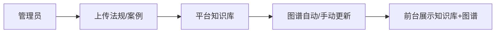

|功能|说明|
|--|--|
|知识库管理|上传/更新/废止 法规、类案、合规条款|
|图谱管理|查看/编辑 法条-案由-证据 关系，导入 CSV|
|数据统计|文档数量、入库状态、最后同步时间|
|前台展示|用户可浏览法规目录、查看关系图谱（只读）|

### 双库架构（关键设计）

```
┌─────────────────────────────────────────────────────────┐
│                    平台公共知识库（全员共享）               │
│  law 法规 │ case 类案 │ compliance 合规 │ 图谱 Neo4j    │
└───────────────────────────┬─────────────────────────────┘
                            │ Agent 联合检索
┌───────────────────────────┴─────────────────────────────┐
│                    用户私有库（按 user_id 隔离）           │
│  contract 合同 │ dispute 纠纷 │ report 分析报告          │
└─────────────────────────────────────────────────────────┘
```

|库|谁维护|谁可见|用途|
|--|--|--|--|
|**平台库**|管理员|所有用户（只读）|RAG 查法规/类案、图谱查关系|
|**用户库**|用户自己|仅本人|报告分析、基于材料的问答|

---

## 2. 文档入库：上传 → 切分 → 分类 → 打标 → 存储

### 2.1 上传流程

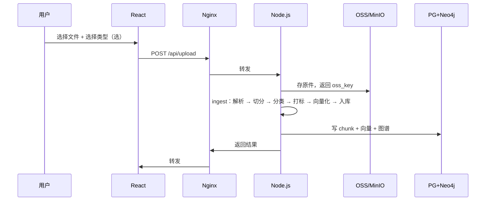

**两类上传入口：**

|入口|doc_type|说明|谁操作|存入|
|--|--|--|--|--|
|管理后台|`law`|法律法规|管理员|**平台库**|
|管理后台|`case`|裁判文书/典型案例|管理员|**平台库**|
|管理后台|`compliance`|合规条款/准则|管理员|**平台库**|
|用户工作台|`contract`|合同|中小企业|**用户库**（user_id 隔离）|
|用户工作台|`dispute`|纠纷描述/证据|街道/信访|**用户库**|
|系统生成|`report`|分析报告|系统自动|**用户库**（关联 source_doc_id）|

### 2.2 怎么切、存什么

**原则：法规与案例分开切，存入同一张 chunk 表，用 doc_type 区分；打标结果写入文档/块级 metadata，供检索过滤。**

|doc_type|切分方式|打标字段（metadata）|存什么|存哪里|
|--|--|--|--|--|
|**law** 法规|1 条法条 = 1 个 chunk，不拆开|法律名、层级、领域（劳动/合同/物业…）、条号、生效/废止|条号、法律名、正文、标签|PG `document_chunks` + 向量|
|**case** 案例|512 字/段，overlap 64|案由、法院层级、裁判年份、争议焦点|案号、案由、法院、裁判要旨|PG `document_chunks` + 向量|
|**compliance** 合规|256 字/段|合规领域、义务类型、适用主体|合规领域、义务类型|PG `document_chunks` + 向量|
|**contract** 合同|按条款切|合同类型、甲乙方、风险标签（试用期/违约金…）|合同类型、甲乙方|用户库 `document_chunks`（user_id）|
|**dispute** 纠纷|按段落切|纠纷类型、案由、涉及主体、证据类型|纠纷类型、案由|用户库 `document_chunks`（user_id）|
|**report** 报告|按章节切|报告类型、风险等级、关联案由/法条|报告类型、风险点、关联法条|用户库 `document_chunks`（user_id）|

### 2.3 打标

**分类**定 doc_type（用户选择或规则识别）；**打标**在切分后为文档/chunk 补充结构化标签，提升 RAG 过滤与图谱关联精度。

|doc_type|打标方式|典型标签|
|--|--|--|
|law|规则解析（条号正则 + 法律名映射）|`{domain:"劳动", level:"法律", article_no:"39"}`|
|case|LLM 抽取 + 规则校验|`{cause:"物业纠纷", court_level:"基层", year:2024}`|
|compliance|管理员上传时选 + 关键词规则|`{domain:"数据合规", duty_type:"告知义务"}`|
|contract|LLM 读条款 + 规则引擎|`{contract_type:"劳动", risk_tags:["试用期","违约金"]}`|
|dispute|LLM 抽取|`{dispute_type:"邻里", cause:"噪音", parties:["业主","物业"]}`|
|report|报告生成时写入|`{report_type:"contract_review", risk_level:"高"}`|

**落库：** `documents.metadata_json`（文档级）+ `document_chunks.metadata_json`（块级，继承并细化文档标签）。检索时可按标签 pre-filter，再走向量召回。

```json
// document_chunks.metadata_json 示例（案例 chunk）
{
  "doc_type": "case",
  "cause": "物业纠纷",
  "court_level": "基层",
  "tags": ["物业服务合同", "违约金"]
}
```

**PostgreSQL 核心表：**

```
documents          ← 文档元数据（oss_key, doc_type, user_id, scope, metadata_json）
document_chunks    ← 文本块 + embedding + metadata_json（平台库 user_id=null，用户库带 user_id）
reports            ← 分析报告（id, user_id, source_doc_id, type, content_json, confidence）
conversations      ← 对话（id, user_id, report_id, title, track, created_at）
messages           ← 每轮消息（id, conversation_id, role, content, citations_json, suggested_questions, confidence, created_at）
message_citations  ← 引用明细（message_id, chunk_id, document_id, source_type, source_title）
```

**OSS 只存原件**，不做检索。检索走 PG 向量库。

### 2.4 报告生成流程（用户上传 → 分析报告）

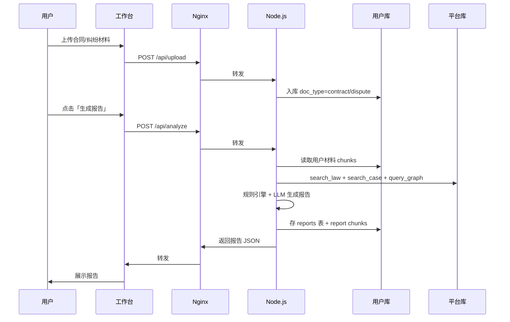

**报告结构（content_json）：**

```json
{
  "report_type": "contract_review | dispute_analysis | labor_risk",
  "summary": "一句话结论",
  "risk_items": [
    {"level": "高", "desc": "...", "law_ref": "劳动合同法第39条", "chunk_id": "..."}
  ],
  "citations": [
    {"chunk_id": "...", "document_id": "...", "source_title": "劳动合同法第39条", "source_type": "law"}
  ],
  "suggested_questions": ["风险2怎么改？", "有没有类似类案？"],
  "confidence": 85,
  "graph_path": ["案由:物业纠纷", "证据:物业服务合同"]
}
```

### 2.5 入库后如何用

**普通问答**：查平台库（法规 + 类案）  
**报告问答**：查用户报告 + 用户材料 + 平台库（三重联合）

---

## 3. RAG 方案（LangChain.js）

### 3.1 检索流程

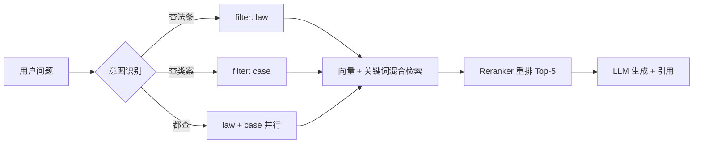

**LangChain.js 组件映射：**

|步骤|组件|
|--|--|
|文档加载|pdf-parse + mammoth|
|切分|RecursiveCharacterTextSplitter（法规自定义按条切）|
|向量化|Embedding API|
|存储|`@langchain/community` PGVectorStore|
|检索|EnsembleRetriever（向量 + BM25）|
|重排|CohereRerank 或 Reranker API|
|生成|LangGraph.js Agent|

### 3.2 法规 vs 案例：分开存、Agent 合并查

||法规 law|案例 case|
|--|--|--|
|**典型问题**|「劳动合同法第39条说什么？」|「物业纠纷类似案例怎么判？」|
|**检索方式**|条号精确匹配 + 向量|纯向量语义|
|**Agent 工具**|`search_law(query)`|`search_case(query, cause?)`|

---

## 4. 知识图谱：存什么、怎么用、什么时候用

### 4.1 存什么（Neo4j）

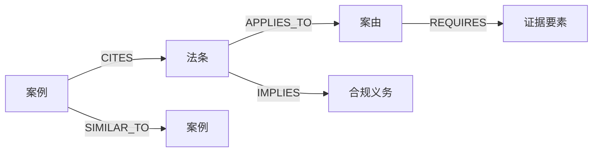

|节点|示例|
|--|--|
|LawArticle|劳动合同法第39条|
|CaseCause|物业服务合同纠纷|
|EvidenceElement|物业服务合同、缴费记录|
|ComplianceObligation|签订书面劳动合同|
|LegalCase|（2024）沪01民终123号|

|关系|含义|
|--|--|
|APPLIES_TO|法条适用于某案由|
|REQUIRES|案由需要某证据|
|CITES|案例引用某法条|
|IMPLIES|法条蕴含某合规义务|

### 4.2 数据怎么进 Neo4j

|来源|方式|
|--|--|
|案由-证据对应表|专家 CSV → 批量导入脚本|
|法规入库|自动创建 LawArticle 节点|
|案例入库|LLM 抽取引用法条 → 建 CITES 边|

### 4.3 什么时候用图谱 vs RAG

|用户问题|用什么|为什么|
|--|--|--|
|「类似案例怎么判？」|**RAG**|需要读判决书原文|
|「物业纠纷要准备哪些证据？」|**图谱**|固定关系，多跳查询|
|「第39条内容是什么？」|**RAG**|查法条原文|
|「哪些法条管劳动合同解除？」|**图谱**|法条→案由关系链|
|「我的合同有没有风险？」|**RAG + 规则**|读合同 + 硬性校验|

---

## 5. Agent 搭建：LangGraph.js + Tools

### 5.1 Function Calling / Tools

Agent 直接使用 **Function Calling / Tools**：LangGraph.js 注册工具，LLM 按需调用 `searchLaw`、`queryGraph` 等内部方法，无需 MCP 等额外协议层。

### 5.2 Agent 工具清单

```typescript
// Node.js — @langchain/langgraph
const tools = [
  searchLaw,        // RAG 查法规
  searchCase,       // RAG 查类案
  queryGraph,       // Neo4j 多跳
  checkRules,       // 规则引擎
  getUserReport,    // 读用户报告
  searchUserDocs,   // 查用户材料
];
```

### 5.3 LangGraph Agent 流程

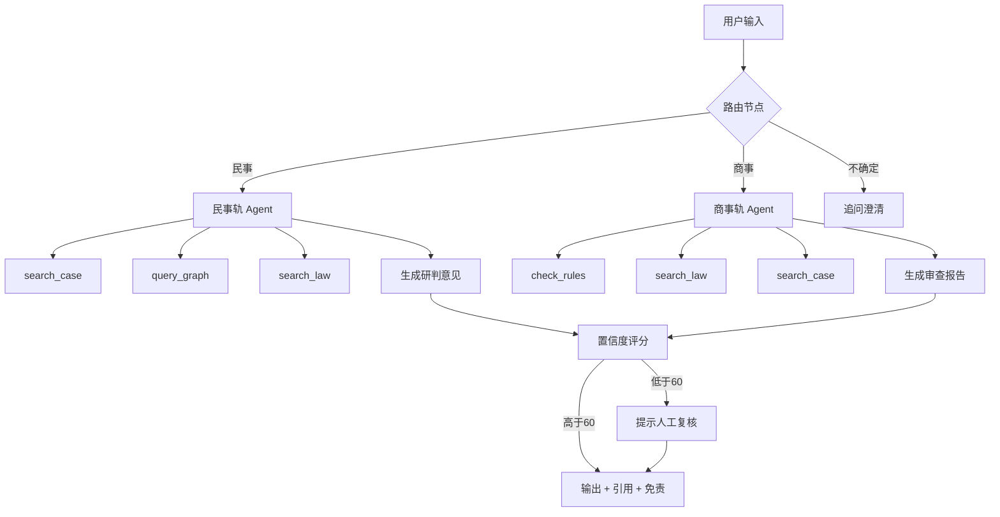

**LangGraph 节点：**

|节点|做什么|
|--|--|
|`router`|LLM 判断民事/商事/混合|
|`retrieve`|调用 Tools 检索|
|`generate`|基于检索结果生成，强制引用格式|
|`score`|置信度评估（检索命中数 + LLM 自评）|
|`human_review`|低置信度转人工|

## 6. 智能问答（WebSocket 长连接多轮）

> 同一 WS 连接内完成多轮追问；会话级绑定 `session_id`，可绑定 `report_id` 做报告问答。

### 6.1 两种问答模式

|模式|触发条件|检索范围|典型场景|
|--|--|--|--|
|**通用问答**|无绑定报告|平台法规 + 类案 + 图谱|「物业纠纷怎么处理？」|
|**报告问答**|会话绑定 report_id|**用户报告** + 用户材料 + 平台库|「我合同第2条风险严重吗？」|

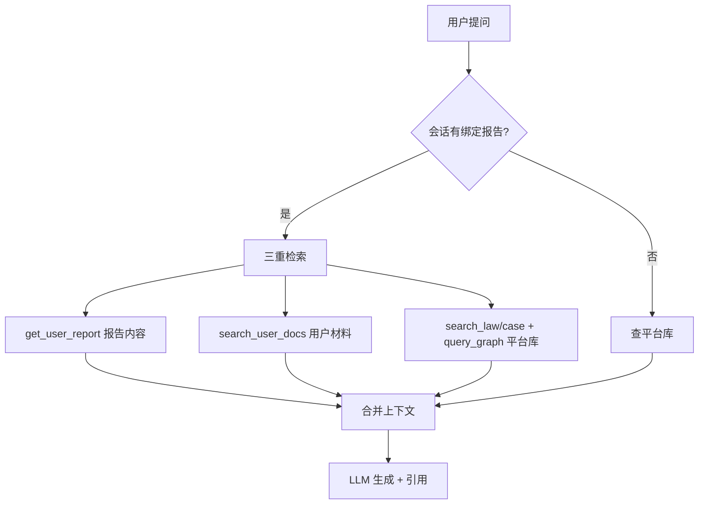

**报告问答 Prompt 要点：**

```
当前用户有一份《{report_type}》报告（见下方），请优先结合报告内容回答，
再引用平台法规/类案作为依据。引用需区分：
- [报告] 来自用户分析报告
- [用户材料] 来自用户上传原文
- [法规/案例] 来自平台知识库
```

### 6.2 问答 vs 五大模块

||智能问答|M1–M5 模块|
|--|--|--|
|**交互**|自由对话，多轮追问|固定流程，一键生成报告|
|**入口**|聊天框（可绑定报告）|工作台「生成报告」按钮|
|**输出**|流式文字 + 引用卡片|结构化报告 → 可继续问答|
|**关系**|模块生成报告 → 自动绑定会话 → 进入报告问答||

### 6.3 问答完整流程（WebSocket 多轮 + 报告上下文）

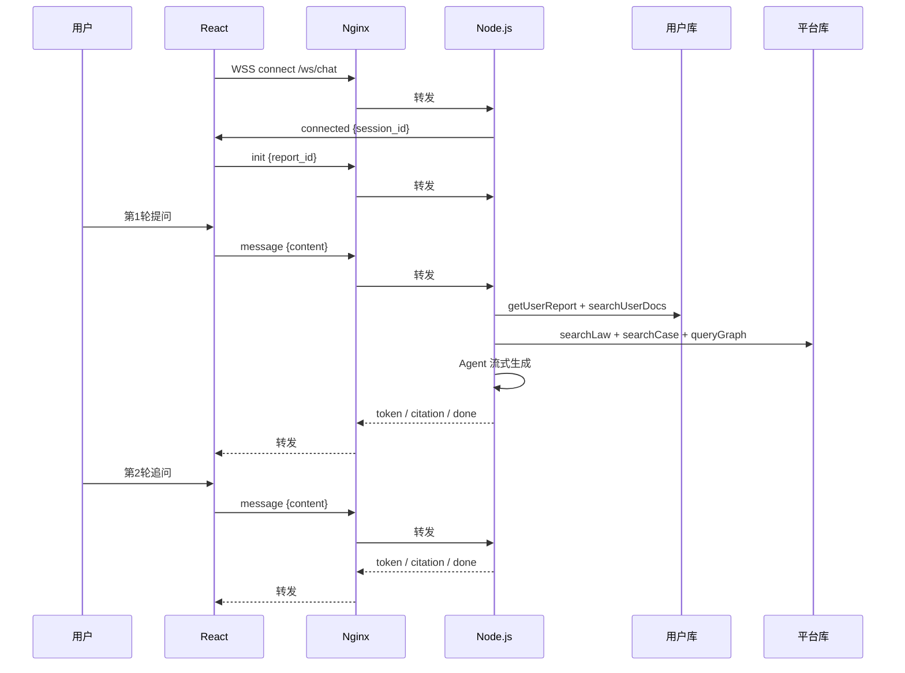

### 6.4 问答类型与 Agent 行为

|问答类型|示例|检索范围|输出|
|--|--|--|--|
|**报告追问**|「报告里第2条风险怎么改？」|报告 + 用户材料 + 平台法条|针对报告的具体建议|
|**材料对比**|「我的合同和类案比有什么差异？」|用户材料 + 平台类案|对比分析|
|**法条查询**|「劳动合同法第39条说什么？」|平台法规|法条原文|
|**类案检索**|「类似物业纠纷怎么判？」|平台类案|案例摘要|
|**关系查询**|「还需要哪些证据？」|报告案由 + 图谱|证据清单|
|**合规咨询**|「没签劳动合同有什么风险？」|规则 + 平台法条|风险点|

**多轮上下文策略（PG 为主，Redis 可选）：**

```
WebSocket 连接内（内存，仅轻量状态）：
  session_id     ← 建连时分配或恢复
  report_id      ← init / bind_report 绑定

PostgreSQL（权威存储）：
  messages       ← 每轮 user/assistant 实时写入
  message_citations ← 引用 chunk_id + document_id

每轮 message：
  1. INSERT user message
  2. SELECT 最近 10 轮 messages → 组装 Agent history
  3. Agent 生成 → done 后 INSERT assistant message

Redis（可选，并发量大时）：
  缓存 conv:{session_id}:history，减少重复查 PG
  触发条件：并发 WS > 50 或 history 查询 P95 > 100ms
```

## 7. 五大模块：统一模式「上传 → 报告 → 问答」

### 7.1 统一用户路径（申报表五大模块共性）

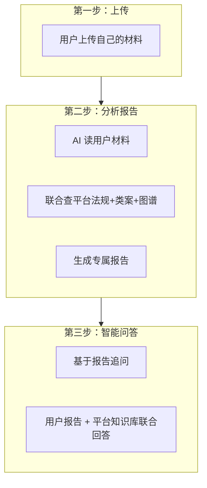

|模块|用户上传什么|生成什么报告|典型追问|
|--|--|--|--|
|**M1** 纠纷研判|纠纷描述/证据|《纠纷研判报告》|「还需补什么证据？」|
|**M2** 合同审查|合同 PDF|《合同审查报告》|「第2条风险怎么改？」|
|**M3** 用工排查|用工问卷/描述|《用工风险报告》|「加班条款合规吗？」|
|**M4** 文书生成|案由+事实|《起诉状草稿》|「证据清单完整吗？」|
|**M5** 证据指引|选择案由|《证据清单+流程》|「下一步怎么走？」|

**对应申报表场景：**

- 街道/信访 → M1 + M5（民事轨）
- 中小企业 → M2 + M3（商事轨）
- FDE 实训 → 全流程 Demo

---

### M1 纠纷智能研判（P0）

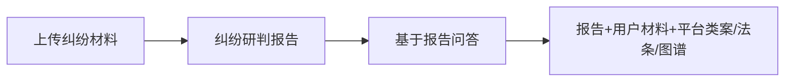

**验证：**

- [ ] 物业/邻里/借贷 3 类：上传 → 报告 → 问答全流程
- [ ] 报告含案由、证据清单、≥3 条引用
- [ ] 追问「还需什么证据」能调图谱 REQUIRES

---

### M2 合同智能审查（P0）

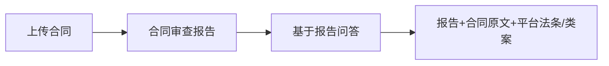

**验证：**

- [ ] 5 份合同样本，风险召回 ≥ 80%
- [ ] 报告问答 10 题，80% 引用报告具体风险点
- [ ] 回答含 [报告] + [法规] 双重引用

---

### M3 劳动用工风险排查（P0）

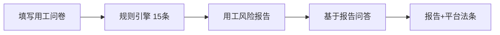

**验证：**

- [ ] 15 条用工规则 100% 命中
- [ ] 问卷 → 报告 → 问答全流程
- [ ] 10 场景风险等级与专家一致 ≥ 80%

---

### M4 诉讼辅助文书生成（P1）

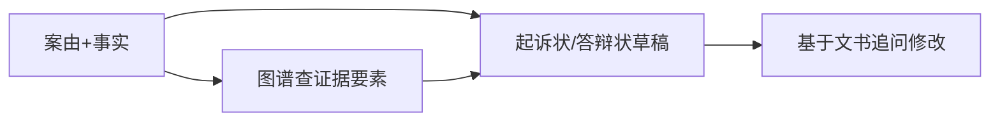

**验证：**

- [ ] 3 种案由生成完整文书框架
- [ ] 可对文书内容继续问答修改

---

### M5 证据清单与流程指引（P1）

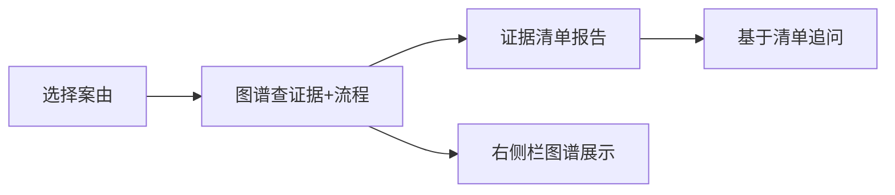

**验证：**

- [ ] 10 个案由证据清单 ≥ 80% 准确
- [ ] 前台图谱可视化案由→证据关系

---

## 8. 实施计划（单场景）

> **范围约束：** 全栈实施；M1–M5 **不必全做**，打通「上传 → 报告 → 问答」闭环即可，**任选 1 个场景**。

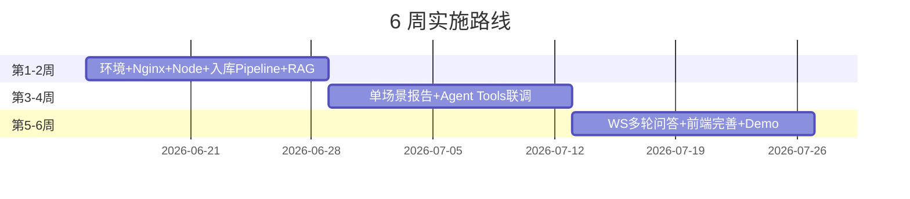

|阶段|周次|交付|说明|
|--|--|--|--|
|基础|第 1–2 周|Nginx + Node.js + 入库 Pipeline + RAG|docker-compose 跑通；<br/>法规/案例切分打标入库；<br/>Embedding → PG 召回 → Reranker；<br/>预置 20–50 条法条 + 若干类案|
|核心|第 3–4 周|**单场景**端到端 + Agent|如 M2：上传合同 → 《合同审查报告》→ 6 Tools 联调；<br/>通用问答可先用 REST 冒烟|
|收尾|第 5–6 周|WS 多轮 + 前端 + Demo|报告/通用双模式 WSS；<br/>React 三栏联调；管理后台最小可用；录屏答辩|

**单场景选型（三选一即可）：**

|推荐|模块|理由|
|--|--|--|
||M2 合同审查|PDF 上传成熟，报告结构清晰，商事轨 Demo 友好|
||M1 纠纷研判|贴近街道/信访，侧重类案 + 图谱|
||M3 用工排查|规则引擎可展示，适合合规向 Demo|

M4/M5、图谱前端可视化、SurrealDB 对比 POC **可选**，有余力再做。

---

## 9.实施要点

|方向|内容|1.5 个月最小集|
|--|--|--|
|全栈|React 工作台 + Node.js API/Agent + Nginx 部署|三栏 UI 够用即可，管理后台|
|数据|PostgreSQL + pgvector；图谱可先简化|Neo4j 可后置；先用 PG 向量 + metadata 跑通 RAG|
|场景|**只做 1 个 M 模块**|其余模块复用同一套「上传→报告→问答」模板|
|验证|Recall@3、报告 3 条、问答 5 轮|能现场演示完整用户路径即达标|

**阶段自检：**

- [ ] 第 2 周末：`POST /api/upload` 成功；RAG 问法条能返回 `chunk_id`
- [ ] 第 4 周末：选定场景报告 JSON 可生成并落库；Agent Tools 调通
- [ ] 第 6 周末：WSS 多轮 + 基于报告追问；Demo 可录屏

---
